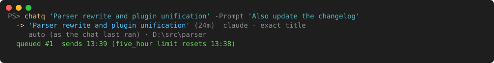
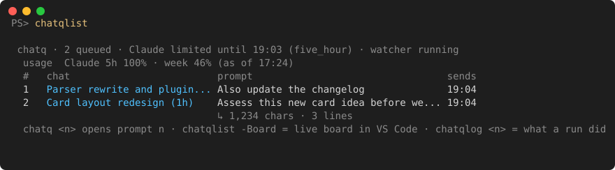
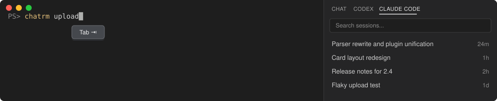
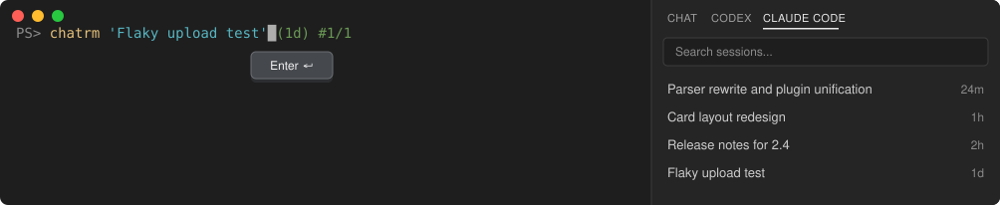
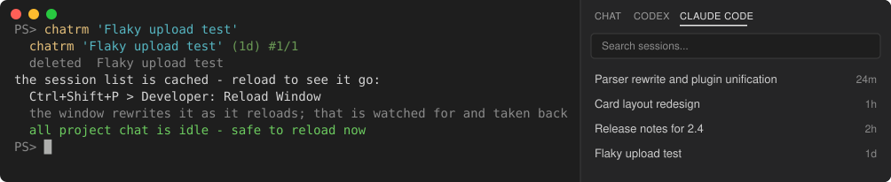
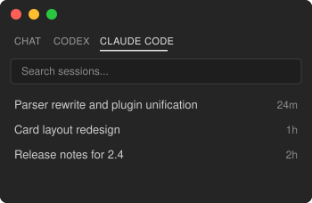

# VS-code-chat-manager

Find, delete, archive and queue prompts for your local AI chats — Claude Code,
Codex and GitHub Copilot Chat — from PowerShell.

[](https://github.com/phal40lax78/VS-code-chat-manager/releases)
[](https://github.com/phal40lax78/VS-code-chat-manager/actions/workflows/test.yml)
[](LICENSE)
[](#requirements)
[](FUTURE_WORK.md#sponsorship)





- **Find any chat by part of its title** and Tab-complete it: `chatfind`, `chatrm`, `chatq`.
- **Delete one chat** and everything it leaves on disk, or **archive** it and bring it back later.
- **Queue prompts while the usage limit is hit.** At the reset each chat is resumed in turn, sent its prompt, and run to the end.
- **Waits out `API Error: 529 Overloaded`** by watching status.claude.com, and resumes as soon as Claude Code is back.
- **Tells you how it went:** a desktop toast, your phone through Join or ntfy, or a command of your own.
- **Shows every running chat at a glance:** `chatoverlay` keeps a small panel on top — each open chat's project, title, newest prompt and whether it waits on you, with usage live at the top. On Windows it starts by itself, and a click on a chat opens it as a tab in VS Code.
- **Does all of it in the panel's place:** `chatconsole` turns the panel into a console — pick a chat, write to it, drop files on it, send now or queue it; continue the chats the limit cut off; start new ones; run the queue.

One script and the `src/` folder it loads, no modules, nothing to build. It was two tools — chatrm and chatq — and is now one, with one index and one install.

## Install

**From VS Code:** install **VS Code Chat Manager** from the Marketplace -
search the Extensions view, or:

```powershell
code --install-extension redaechan.vs-code-chat-manager
```

On its first start it puts the scripts in `~/Tools/VS-code-chat-manager`,
asks once before adding the line that loads them to your PowerShell profile,
and from then on VS Code's own extension updates keep the scripts up to date
too. [What it does, step by step](extension/README.md). Then open a new
terminal and type `chat`.

**Terminal only**, without the extension:

```powershell
iex (irm https://raw.githubusercontent.com/phal40lax78/VS-code-chat-manager/main/install.ps1)
```

Then type `chat`. The commands are live in the shell you ran that in, and the
line the installer writes into `$PROFILE` brings them back in every new one. It
downloads the repo as one zip and copies `VS-code-chat-manager.ps1` and `src/`
to `~/Tools/VS-code-chat-manager`; set `$env:CHAT_MANAGER_DIR` first to put it
somewhere else. The first install builds the search index, about 30 seconds.

Already have the files? Load the script and install. It loads its parts from
`src/` beside it, so copy the two together; without them it says which are
missing and loads nothing.

```powershell
. "$HOME\Tools\VS-code-chat-manager\VS-code-chat-manager.ps1"
chatinstall
```

The leading dot matters: `. file.ps1` loads the commands into this shell, while
`& file.ps1` runs them into a scope that is thrown away. The script notices and
prints the line you meant.

**Coming from chatrm or chatq?** `chatinstall` replaces their profile lines with
this one — both define the same commands. The commands keep their names.

**Updating:** with the extension, VS Code does it. VS Code fetches a new
version by itself, and a window starts running it once you click **Restart
Extensions** or reload. The first window to do so puts the new scripts in
place. An extension installed from a `.vsix` file is pinned and never
updates by itself: right-click it in the Extensions view and turn on **Auto
Update**. Without the extension, run the one-liner again. It says `updated 0.2.0 -> 0.3.0` or `unchanged`; an
`unchanged` right after a push is GitHub serving the old copy for a few
minutes. Either way a background watcher that is running switches to the new
copy after its current job, and a running overlay restarts on it at once. The
extension never writes into a folder that is a git checkout; it says when the
scripts there are another version than itself.

## Contents

- [Commands](#commands)
- [Find and delete](#find-and-delete)
- [Archive and restore](#archive-and-restore)
- [Queue prompts for when the limit resets](#queue-prompts-for-when-the-limit-resets)
- [Alerts](#alerts)
- [The overlay](#the-overlay)
- [The console](#the-console)
- [Chats open in VS Code, and the extension](#chats-open-in-vs-code-and-the-extension)
- [Codex](#codex)
- [Where it looks, and what it writes](#where-it-looks-and-what-it-writes)
- [How it compares](#how-it-compares)
- [Things to know](#things-to-know)
- [Uninstall](#uninstall) · [Requirements](#requirements) · [Sponsorship](#sponsorship)

## Commands

| | |
|---|---|
| `chatfind "text"` | find chats by title or message; emits objects |
| `chatrm <id>` / `chatrm "title"` | delete a chat, permanently |
| `chatrm ... -Archive` / `chatrestore [<title>]` | put a chat away / list the archive, bring one back |
| `chatclean` | delete ghost chats left behind by the VS Code list |
| `chatq <title\|id> [-Prompt s]` | queue a prompt for that chat; without `-Prompt` an editor tab opens |
| `chatq <title> -Continue` | queue *"Continue from where you left off."* for a chat the limit cut off |
| `chatq <title> -Attach a.png, b.pdf` / `-Paste` | send files, a screenshot or the clipboard with the prompt |
| `chatq <n>` | open queued prompt *n* in the editor — edits count until it is sent |
| `chatqlist [-Board] [-All]` | what is queued, when it sends, what ran, the usage |
| `chatqrm <n> [-Force]` | drop a job; `-Force` cancels a running one |
| `chatqrun [<n>] [-Now] [-First] [-Stop]` | requeue *n*, move it up, stop waiting and try now, stop the watcher |
| `chatqlog <n> [-Raw]` | what a run did |
| `chatqnotify` | desktop, phone and command alerts |
| `chatoverlay [-Stop] [-Collapse] [-Refresh] [-Console] [-Theme dark\|light\|system] [-Print]` | every open chat, the queue and live usage in a panel that stays on top; `-Console` opens the console |
| `chatconsole` | all of the above in the panel, grown into a console: write, send now, queue, continue, new chats; Esc for the panel again (Windows) |
| `chatproviders` / `chatindex` | which tools were found / rebuild the index |
| `chatinstall` / `chatuninstall [-All]` | add to, or drop from, your profile |
| `chat` | cheat sheet |

`chatrm` flags: `-Force` `-AllProjects` `-WaitForIdle` `-DropJobs` `-Archive`
`-Provider claude|copilot|codex`. `chatfind` adds `-Deep` and `-All`.
`chatq` flags: `-WhatIf` (show the pick only), `-Mode auto|acceptEdits|…`,
`-Model <name>`, `-First`, `-At 13:00` / `-In 2h`, `-AllProjects`,
`-Provider claude|codex`, `-Attach <files>`, `-Paste`.

```powershell
chatfind commit | Select-Object Provider, Title, Id, Age
```

## Find and delete

Claude Code, Copilot Chat and Codex keep every chat on disk, and none offers a
per-chat delete: `claude project purge` works a whole project at a time, and
archiving in VS Code only hides a chat. `chatrm` deletes one chat, whichever
tool wrote it.

Type any part of a title — no quotes, no id, no exact spelling — then press Tab:



Tab fills in the whole argument, quoted for you, with the chat's age and which
match it is: `(1d)` since it was last touched, `#1/1` the only chat that matched.
Then Enter:





The panel still lists it until the window reloads — VS Code caches the session
list (**Ctrl+Shift+P → Developer: Reload Window**, or the
[extension](#chats-open-in-vs-code-and-the-extension) offers a button). After
that it is gone there too:



### Tab

Tab fills in the **whole argument**, not the word under the cursor — for
`chatrm`, `chatfind` and `chatq` alike:

```
chatrm gitign<Tab>     chatrm 'Gitignore file' (21d) #1/2
(down)                 chatrm 'Gitignore rules' (5d) #2/2
```

Tab/down for the next match, Shift+Tab/up for the previous, Enter runs it,
Ctrl+Space opens the full list. Hex matches ids. Subagent chats are left out
unless `-All`, and `chatq` is never offered a Copilot chat. Opt out with
`$ChatNoKeyBindings = $true` before the dot-source.

### Deleting is permanent

Titles match on **substring**, so part of a title is a search, not a choice —
`chatrm Haiku` matches *Haiku ChatGPT Opus Astra*. So a fragment never deletes
on its own:

- **Part of a title:** Enter fills the match in, the way Tab would, and has to be
  pressed again on the full title. Where no key handler reaches — a script,
  `-NoProfile`, no VT — it asks `delete permanently? y / Enter = yes`.
- **A whole title** deletes. Typing all of it is the decision.
- **An id** deletes. An id is exact.
- **`-Force`** skips all of the above.

There is no recycle bin. `chatrm` removes the transcript and everything it
leaves behind — for Claude the sidecar folder (subagents, tool results),
`file-history`, `session-env`, `tasks`, `debug`, the security, telemetry and todo
files, a background job's folder, and its plan file when no other chat in the
project shares it; for Copilot `chatEditingSessions`. The inventory follows
[claude-chats-delete](https://github.com/ataleckij/claude-chats-delete)'s. The
leftovers go only once the transcript is really gone: on Windows a chat a live
window still holds open fails as `LOCKED`, and keeps all of it.

A chat with a prompt queued for it by `chatq` is kept, and the job named;
`-DropJobs` drops the jobs first.

### Scope

Titles match chats of the directory you are standing in — Claude by its project
slug, Copilot and Codex by the folder name — so a sibling repo never answers for
this one. `-AllProjects` widens it. Ids skip scoping: one id is one chat.

### Ghosts

A chat still listed in the panel is one the window is tracking, and the window
writes it back as an empty stub when it reloads. A `FileSystemWatcher` takes that
stub back the moment it lands, and `data/rewritten.txt` remembers the delete for
shells that were not open at the time. `chatclean` sweeps whatever slips past.

### Reloading safely

A reload restarts every extension in the window, so one taken mid-answer loses
that answer — and every workflow and background agent that chat started dies
with it. Every delete ends by saying whether now is a safe moment —
`all project chat is idle - safe to reload now` — and `-WaitForIdle` blocks until
it is. The window's Reload offer says the same (see
[the extension](#chats-open-in-vs-code-and-the-extension)).
Showing a queued run's chat fresh is no reload: the chat opens in an editor
tab of its own, and nothing else in the window restarts. It still acts
without asking only on the same judgement.

What counts as a chat still working, in this project:
- **Claude says so.** `claude agents --json` lists every chat open in a window as
  `busy` or `waiting` (a permission prompt).
- **Work sent to the background.** The turn that starts a workflow or a
  background agent ends at once, so the chat can read as finished while the
  work goes on. Its transcript is searched for a start with no
  `<task-notification>` after it. Only starts since the chat's process began
  count, because anything older died with an earlier process. A background
  shell does not count: it may be a server that never stops.
- **The transcript itself**, for Codex and for chats Claude does not list.
  Anything written in the last minute counts. So does an unanswered `tool_use`,
  because a chat parked on a permission prompt writes nothing.

## Archive and restore

```powershell
chatrm 'Old experiment' -Archive     # out of the way, not gone
chatrestore                          # what is archived
chatrestore 'Old experiment'         # back where it was
```

- **Claude:** the transcript and its leftovers move into
  `data/archive/claude/<id>/`, with a manifest of where each came from.
  `chatrestore` moves them back — replacing the empty stub the window may have
  written there meanwhile, never a real chat — and the panel shows it after a
  window reload. A chat still open in a window is not archived: it would go on
  writing to the old path.
- **Codex:** through Codex's own `codex archive` / `codex unarchive`, since Codex
  keeps thread state in its own databases. `chatrestore` lists what chatrm
  archived, and threads in Codex's `archived_sessions` folder when it has one.
- **Copilot:** VS Code archives those itself, from its chat list.

`chatuninstall -All` refuses while the archive holds anything — it is the only
copy — unless `-Force`.

## Queue prompts for when the limit resets

The VS Code panel queues a message you send while Claude is working. What it
won't do is hold one you send while the subscription limit is used up: that is
refused with *"You've hit your session limit"* and dropped. So you wait, and at
the reset you go round every chat typing again. `chatq` is the queue for that
moment:

```
PS> chatq 'Parser rewrite and plugin unification' -Prompt 'Also update the changelog'
  -> 'Parser rewrite and plugin unification' (2h)  claude · exact title
     auto (as the chat last ran) · D:\src\parser
  queued #1  sends 13:01 (five_hour limit resets 13:00)
```

### Long prompts, files and screenshots

- **Long text, quotes, anything:** leave `-Prompt` off. An editor tab opens on
  the prompt file; paste anything into it — quotes, newlines, `$`, Hangul — then
  save and close it. `chatq <n>` reopens it, and edits count until it sends.
- **Files:** `-Attach a.png, spec.pdf, notes.txt`, with commas — after a space
  the next name would be read as part of the title — or `-Attach .\shots\*.png`.
  They are copied into the job (`data/queue/<id>/`) at once, so the originals
  can move or change; one missing or locked queues nothing.
- **The clipboard:** `-Paste` takes what is on it now — a screenshot, files
  copied in Explorer, or text, which becomes the prompt or goes under the one
  given. Windows only.
- **In the editor tab,** Ctrl+V pastes a screenshot into the prompt. VS Code
  saves it beside the prompt file, in `data/queue/`, and chatq moves it into the
  job. A link to any other file is left as it is: it names that file where it
  is, for the chat to open — or change — there, not a copy of it.
- **Forgot one?** `chatq <n> -Attach shot.png` (or `-Paste`) adds to job *n*
  while it waits.

| | images (png, jpg, gif, webp) | other files |
|---|---|---|
| Claude | named under the prompt; Claude Code opens each with its Read tool and sees the picture | named under the prompt; it reads text, code and PDF |
| Codex | attached with `-i`, as if pasted into the chat | named under the prompt |

What goes under the prompt reads `Attached files - read each one:`, then the
paths. A "continue" sends none — they went with the prompt. `chatqlist` counts
them (`+2 files`); delete one from the job's folder to drop it, and `chatqrm`
removes them with the job. Over 10 files or 20 MB draws a warning: each one
costs context, and usage.

### How it picks the chat

It picks when you queue, not when it sends — you are at the keyboard now and gone
later, so the pick is printed while a wrong one can still be undone
(`chatqrm <n>`).

1. **An id** (hex, at least 6 characters) is that chat.
2. **A title** is matched in this project first — *exact*, then *contains*, then
   *every word in any order* — and in every project only when this one has none.
3. **Nothing matches:** the candidates are this project's chats. It never guesses
   across projects, and standing in no project at all it refuses unless
   `-AllProjects`.
4. **Several candidates:** the newest wins, unless others were active within 5
   hours of it — one limit window — and then the most relevant one does: the
   cosine of character pairs between what you typed (and the prompt) and each
   chat's title and prompts. Pure PowerShell, no model call, Hangul and English
   alike. The runner-up and both scores are printed.

A Copilot chat is found but refused: no CLI can resume one.

### When it sends

- **The reset time** comes from the record Claude writes into the transcript it
  cut off, or from Codex's rate-limit snapshot.
- **A probe goes first:** a throwaway `ok` that saves no session, asked with the
  model the run will use. Sending the real prompt while still limited would
  plant it, and an error after it, in your chat.
- **One job at a time, in queue order** — oldest first, `-First` jumps the line.
  A Claude job never waits behind a Codex limit, nor one account behind another.
- **In the permission mode the chat last used**, `-Mode` overriding it for one
  job, and on the chat's own model, `-Model` overriding that. Anything that would
  ask a question is denied, since nobody is there to answer.
- **Needs input:** a denied tool, or plan mode stopping at a plan, parks the job
  and the queue moves on. `chatqrun <n> -Mode acceptEdits` sends it a "continue"
  in a mode that allows it.
- **A limit hit again mid-run** puts the job back; if its prompt had reached the
  chat, the retry is a "continue", never the prompt twice.
- **`API Error: 529 Overloaded`** (any 5xx) is Anthropic's side. The job goes back
  and chatq watches <https://status.claude.com> every minute, resuming the moment
  Claude Code is `operational` again; one the page never shows is retried after
  1, 2, 5 and 10 minutes, then every 15. One alert, and a reminder at 6 hours.
- **A dropped connection** is retried after 1, 2 and 5 minutes, then fails.
- **A refused login** — an expired login, or a subscription that ran out, which
  the API turns down the same way — holds that account's jobs, with one alert
  that quotes what Claude or Codex said: `Claude login refused: OAuth token has
  expired. (401)`. They go once the login works again; chatq looks every 15
  minutes.
- **A job that keeps breaking before any reply** gives up after `maxRetries` (5)
  tries in a row. A long task that gets through several limit windows moves on
  each time and is never stopped by this.

Chats you left cut off — by the limit or a 529 — show in `chatqlist`, and
`chatq <title> -Continue` queues one. A continue chatq queued itself is dropped
if the chat moved on meanwhile; one you asked for is always sent.

### Status

- **`chatqlist`** is one line per job, fitted to the terminal; a long prompt
  shows its first line and a size note. Above them, what everything waits on and
  how much of each window is used — `usage  Claude 5h 83% · week 41% (as of
  12:10)` — read from Claude's and Codex's own caches, with their age. Those
  caches only refresh when the tool itself runs, so a reading over an hour old
  is marked `stale`, and the window that is blocked reads `limited`
  (`5h limited`) rather than a percentage from before the limit.
- **`chatq <n>`** opens the whole prompt; edit it until it is sent.
- **`data/logs/jobs.log`** keeps a line per job event — queued, every state it
  moves through, and removals — so a job that left the queue can still be
  accounted for.
- **`chatqlist -Board`** opens `data/queue.md`: **Ctrl+Shift+V** there for VS
  Code's preview, which follows every change the watcher writes.

### The watcher

One per machine, a hidden PowerShell that exits when the queue is empty and is
started again by the next shell after a reboot. While a job is due within 6
hours it keeps the machine from sleeping (the display still turns off, and a
closed lid still sleeps a laptop). `chatqrun -Foreground` runs it in the console
to watch.

## Alerts

```powershell
chatqnotify -ApiKey <Join key> -Device group.phone   # Join
chatqnotify -Ntfy <long random topic>                # ntfy.sh, free
chatqnotify -Command '<PowerShell>'                  # anything else
chatqnotify -Test
```

| channel | |
|---|---|
| desktop toast | on by default (`-Toast off`); nothing leaves the PC |
| Join | keys at <https://joinjoaomgcd.appspot.com>, the **Join API** button; DPAPI-protected on Windows |
| ntfy | published as JSON, so Hangul survives; the topic works as a password — pick a long random one, or your own server with `-NtfyServer` / `-NtfyToken` |
| your command | runs with `$env:CHATQ_EVENT`, `CHATQ_TITLE`, `CHATQ_TEXT`, `CHATQ_PRIORITY`, `CHATQ_JOB`, `CHATQ_PRESENT`; the text never goes on a command line; 30 s at most |

**The phone stays quiet while you are at the PC** — keyboard or mouse used in
the last 5 minutes (`-QuietMinutes`, 0 turns it off) — since the toast already
says it there. `chatqnotify -Test` always goes through.

| event | priority | says |
|---|---|---|
| `chatq · started` | 0 | chat, mode, first line of the prompt |
| `chatq · needs input` | 2 | chat, what was denied, the end of the reply |
| `chatq · done` | 1 | chat, how long, the end of the reply (`asks:` when it ends on a question) |
| `chatq · failed` | 2 | chat, why — including a refused login, in the CLI's own words, or giving up |
| `chatq · limited` | 0 | the limit came back mid-run; when it continues |
| `chatq · overloaded` | 0 | a 529; what status.claude.com says; a reminder after 6 h |

Every title starts `chatq ·`, so a Tasker profile can filter on it. Alerts also
go to `data/logs/alerts.log`. What they carry — the chat title, the end of the
reply — passes through the push service's servers.

## The overlay

```powershell
chatoverlay                 # start it (or show it again)
chatoverlay -Stop
chatoverlay -AutoStart off  # not with every shell and VS Code window (on Windows it is)
chatoverlay -Print          # the same, once, in this console
```


A small panel in the top-right corner that stays above other windows:

- **Usage at the top, live.** A line each for Claude, Codex and Copilot, as the
  collapsed panel has it: `Claude  5h 41% · week 74% · Fable week 2%   22:22`.
  Claude's five-hour and weekly windows, and one model's weekly window once it
  is used; Codex's weekly (and five-hour, on a paid plan); Copilot's monthly
  chat and code quotas, or premium requests on a paid plan. A percent turns
  amber or red as Claude's own usage view would colour it, and each line ends
  with when its figure is from. The settings box switches to **bars** - a bar
  and a reset countdown per window, the same few words under each name - and
  back.
- **Every open Claude chat:** project, title and newest prompt, with a dot for
  what it is doing. Amber is waiting on you (a permission prompt, say) and goes
  to the top; green is working; grey is idle. A chat open in two windows is one
  row. A slash command counts as the newest thing sent. Claude Code writes
  `/compact` down only once it ends, so while it runs the row says a command
  is running rather than showing the prompt before it. After the dot, a
  small mark says where the chat runs: a window outline for a VS Code
  panel, `>_` for a terminal's `claude`.
- **A blue dot for a turn you have not seen,** on Windows only. A chat
  that went from working or waiting to idle while you were elsewhere gets
  a small blue dot just before its state, and the collapsed line and the
  tray dot's tooltip count them (`2 new`). A chat whose window was in
  front as it finished gets none: any window of its VS Code counts, or for
  a terminal's `claude` any tab of the terminal that draws it. A console
  Windows handed off to Windows Terminal (its default-terminal setting)
  cannot be matched, so that chat gets the dot even with its tab in front.
  The chip clears the dot once its open sent the window its request -
  `ended 0`, `25`, `40` or `41` in `overlay.log`; a chat turned away (one
  at work, `10`, a terminal's, or one a queued prompt is running in), an
  open that failed before the request, or one with no answer in 60
  seconds leaves it. A new turn, or its session ending, clears it too. The
  overlay keeps it in memory only, so a restart clears every dot, and
  reading the chat in VS Code clears none.
- **Chats the limit cut off,** in orange, just under those waiting on you:
  `cut off - resets 13:00`, or `529 - waits for Claude`. One no window has
  open gets a row of its own: from the transcripts of the last week while
  its reset is still ahead, else from the last 12 hours. A continue queued
  for it takes the row's place. The console's
  Continue, or `chatq <title> -Continue`, queues one.
- **The queue.** A queued prompt rides on its chat's row (`#3 sends 13:01`), or
  has a purple row of its own when that chat is not open; blue while it runs.
  Prompts queued with no watcher running are called out.
- **Recent,** under all of those, faint: the newest Claude chats not open,
  one line each - project, title, how long ago - five by default. Each
  opens as a tab from its chip, as an open row does. A side transcript, an
  empty one, and a chat whose folder is gone are never listed - a folder
  is looked for again every 3 minutes, and one on a network share or a
  mapped drive is never looked for, so it is listed - and lines the screen
  cannot hold are left off. The list is built again at most once
  a minute, and at once when a chat closes. `chatoverlay -Print` lists them
  too, under the rows, and puts `>_` before a terminal's chat.

**It starts by itself** on Windows: with every new shell, as the watcher
comes back after a reboot, and when a VS Code window starts - the extension
starts it as the window opens, or on a first install the moment it has
copied the scripts, without waiting on its setup's profile question. One
already running is left alone.
`chatoverlay -AutoStart off` keeps it to when you start it, and so does
**Chat Manager: Overlay: start by itself...** in VS Code's command palette
(On or Off; Off also closes a running overlay), with no terminal needed.
Both set `overlay.autoStart` in `data/config.json`. On macOS it starts that
way only after `chatoverlay -AutoStart on`.

**It stays out of the way.** As a panel it never takes focus, and clicks go
through it; only while it is the console (below) does it take the keyboard.
Rest the pointer on it for a moment and a row of buttons appears on its top
edge, outside the panel, flush with its top-right corner - or under the
panel when it sits too near the top of the screen for them. They keep that
side only while they are up, so a panel dragged down from the top has them
on its top edge again the next time they come. Resting on that
spot itself does it too, so you can point straight at the buttons. A pointer
just passing over on its way to the window underneath brings up nothing. Left to
right, with × at the corner as on any window:
- **the grip** (six dots): hold it and drag to move the panel;
- **resize** (a two-way diagonal arrow): hold it and drag - left to widen,
  right to narrow, down for a row more for each row's height, up for one
  fewer. Down never leaves fewer rows than were set, even with fewer chats
  open. The panel's right edge stays where it is, under the buttons.
  Collapsed, only the width changes. The size is kept in `config.json` as
  you let go, and the panel's place in `overlay-state.json`;
- **collapse** (a chevron): folds the panel to one line - how many chats wait,
  work or sit idle, and Claude's usage - and back;
- **refresh** (a circular arrow): asks Claude and Copilot for usage now. It
  turns while it asks, and the end of Claude's line reads `asking...`, then
  `checked 22:22:01` - or why it did not ask. Codex has nothing to ask: its
  figure is what Codex wrote on its last run (`last run Mar 13`), so it moves
  only when Codex runs;
- **console** (a speech bubble): turns the panel into
  [the console](#the-console), in its place; Esc brings the panel back;
- **settings** (two sliders): a box of six rows - opacity on a slider;
  **Width** (260-800) and **Rows** (1-30) side by side on sliders; the
  theme as Dark, Light or System (System follows Windows' own light or dark
  mode); usage as Lines or Bars; **Style**, full or compact rows; and
  **Recent**, off, 5 or 10. A slider applies as it moves - the width with
  the right edge held, and the panel kept on its screen, growing to the
  right by the screen's left edge - and `config.json` gets it a moment
  after it rests. Opened, the sliders show the size the panel has now,
  whatever changed it;
- **hide to tray** (an arrow onto a line): click the tray dot to show it again;
- **×**: closes the overlay. `chatoverlay` starts it again, and so does
  the next shell or VS Code window unless `-AutoStart off`.

The panel itself never takes a click - until it turns into the console; the
buttons are a small window of their own, and they go when the pointer leaves.

**Open a chat from its row.** Move onto a Claude row, or a Recent line, and
rest the pointer there for a moment - 400 ms, or what
`chatoverlay -ChipDelay` set - and a small **open** appears at the row's
right end - a window of its own like the buttons, taking no focus, in
neither Alt+Tab nor the taskbar. A pointer sweeping across brings up
nothing, it shows once per visit to a row, and a pointer it came up under
has to move off it before a click counts, so a pointer parked there never
opens anything by accident. Clicked, it:
- asks the window that has the chat to open it in an editor tab of its
  own, or to bring forward the tab that already shows it
  ([the extension](#chats-open-in-vs-code-and-the-extension) does it). It
  ends no process. A new tab loads the chat from disk; a tab there already
  comes forward as it is, on the process it has. So a queued run that
  ended while that process lived is not in it yet: click the run's
  **Show it**, or close the tab and open the chat again;
- leaves a chat in the side bar where it is when it is working: nothing
  reaches the side bar's chat, and a tab would start a second process on
  it mid-answer. The window says so; click open again once it finishes. A
  working chat is opened only when exactly one Claude tab here carries its
  label and no other chat of its folder would, since a tab carries no
  session id: one of no title, one whose label another tab shares, and
  one whose title another chat of the folder has - or whose first 24
  characters it has, open or not - are left the same way until one of the
  two is renamed. On a Mac, where the window holding a chat cannot be
  told, so is any working chat with no tab of its own here. A chat idle in
  the side bar does get a tab, a second view with a second process, and
  the window says so and asks you to close the side bar's copy;
- unlocks the editor group holding the chat's tab, when it is the active
  group and holds Claude tabs alone. Claude Code locks the group it makes
  for its tabs (`claudeCode.lockEditorGroups`, on by default), and the next
  file you open would go to another group. A group holding other editors is
  left as it is, and so is every group when `claudeCode.lockEditorGroups`
  is set to `true` in any settings scope - that lock is your choice. Claude
  Code's own **Open in New Tab** still locks the group it starts;
  `"claudeCode.lockEditorGroups": false` in VS Code's settings stops that;
- brings that window forward with `code -n <folder>`: VS Code raises its own
  window on that folder, or opens one, which shows the chat as it starts.
  `-n` keeps it from reusing an unrelated window. `code` is the one beside
  the VS Code that is running, else the one on PATH, else where VS Code's
  installers put it; `CHATQ_CODE` overrides all three. Nothing moves the
  pointer, types or activates a window.

The tray says when it could not: a queued prompt running in that chat (open
it once it finishes), a chat open in a terminal, working or not (never
opened in VS Code as well, or there would be two writers), a window that
also has other folders open (shown there, but not brought forward -
`code -n` would open a second one; which windows are on exactly one
folder is read from their titles, a profile's name after the folder's
allowed for), a chat not started yet, or no `code` command. What you pick
in the settings box is kept in `config.json`, like a setting made with
`chatoverlay`; a collapsed panel stays collapsed across restarts.

**Ctrl+Alt+Shift+O** or the tray dot's menu unlocks the whole panel to drag:
it gets a blue edge, and it locks itself again two minutes after the pointer
leaves. The tray dot takes the colour of the most urgent chat. Left-click it to
hide or show the panel; right-click it for Open console, Lock, Hide, Collapse,
Refresh usage, Move to top right and Quit. `chatoverlay -Unlock`, `-Lock`, `-Reset`,
`-Collapse`, `-Expand` and `-Refresh` do the same from a shell.

**How live "live" is.** Claude Code caches its usage in `~/.claude.json`, but
only when a window opens its usage view. So that copy can be hours old: on the
machine this was written on it said 55% while the account stood at 79%. The
overlay asks Claude's usage endpoint itself, the same one `/usage` asks:
- every five minutes while any chat is working;
- every fifteen while all are idle, since nothing moves the figure then;
- straight after a window resets;
- when you press refresh, or run `chatoverlay -Refresh`.

The endpoint is meant for a `/usage` opened now and then. Asked once a minute,
it refused after about an hour, and then said to wait 48 minutes. When it
says how long to wait, the overlay waits that long and says so (`13:25, retry
14:13` at the end of Claude's line), refresh or not, since asking early only
earns another refusal. The last live figure and that wait survive a
restart. Meanwhile it shows the newest figure it has: its own last answer, or
Claude Code's cached one, with its age.

It uses the login Claude Code saved. The token is read for that one request and
is never stored, logged or refreshed: a refresh would sign Claude Code out. If
the login has expired, the overlay shows the cached figure with its age until
Claude Code next runs and renews it. `chatoverlay -LiveUsage off` keeps it to
the cache. Codex's figure comes from its newest session file, which it rewrites
every turn.

Copilot's comes from GitHub, through the GitHub CLI: `gh api
copilot_internal/user`, the answer VS Code's own Copilot status shows, every
fifteen minutes and on refresh. `gh` keeps its own login, so the overlay never
sees a token. With no `gh`, or one not logged in (`gh auth login`), there is
simply no Copilot line; `chatoverlay -CopilotUsage off` stops asking. That
endpoint is GitHub's own, not a documented one, so it may change under it.

**What it costs.** One hidden `powershell.exe`, about 160 MB and under 0.1% CPU.
It reads a file again only once that file has changed, and a transcript only from
where it last stopped. The first look at a 20 MB chat reads the last 256 KB.

Settings live in `data/config.json` under `overlay`. `chatoverlay -Theme`,
`-Opacity`, `-Width`, `-Rows`, `-Compact`, `-ChipDelay`, `-Recent`,
`-UsageView`, `-Hotkey`, `-ConsoleHotkey`, `-AutoStart`, `-LiveUsage` and
`-CopilotUsage` set theirs and apply them at once; after editing the file
by hand, `chatoverlay -Stop` and start it again. `-Width`, `-Rows`,
`-ChipDelay` and `-Recent` refuse a value out of range and save nothing
from that line, as `-Opacity` does; one out of range in the file is held
to the range.

```powershell
chatoverlay -Width 460 -Rows 12   # wider, and up to 12 chats before "+N more"
chatoverlay -Compact on           # one line a chat, no prompt under it
chatoverlay -ChipDelay 250        # the open chip after a 250 ms rest
chatoverlay -Recent 10            # ten chats not open under the rest; 0 for none
```

| key | default | |
|---|---|---|
| `width` | 380 | pixels at 100% scaling, 260–800; the resize handle, the settings box, or `chatoverlay -Width 460`. The right edge stays put |
| `maxRows` | 8 | 1–30; the rest become `+3 more · 2 idle`, and so do the rows that would run past the screen's bottom from wherever the panel sits. The resize handle, the settings box, or `chatoverlay -Rows 12` |
| `opacity` | 0.94 | 0.3–1; the settings box's slider, or `chatoverlay -Opacity 85` |
| `theme` | `dark` | `light`, or `system` to follow the OS; `chatoverlay -Theme system` |
| `prompts` | `true` | `false` hides the prompt lines - compact rows, one line a chat, and good for screen sharing; the settings box's Style, or `chatoverlay -Compact on` |
| `chipDelayMs` | 400 | 100–3000; how long the pointer rests on a row before its open chip comes; `chatoverlay -ChipDelay 250` |
| `recent` | 5 | 0–20; how many chats not open the Recent list shows, 0 for none; the settings box (off, 5, 10), or `chatoverlay -Recent 10` |
| `hotkey` | `Ctrl+Alt+Shift+O` | `chatoverlay -Hotkey Ctrl+Win+F9`; `none` for no key |
| `consoleHotkey` | `Ctrl+Alt+Shift+Q` | opens the console, or brings it forward when another window covers it; again while it is in front, the panel; `chatoverlay -ConsoleHotkey none` for no key |
| `cutOff` | `true` | `false`: no cut-off rows, and no scan for them |
| `autoStart` | `true` on Windows, `false` on macOS | with every new shell and VS Code window; `chatoverlay -AutoStart off`, or **Chat Manager: Overlay: start by itself...** in VS Code's command palette |
| `usageView` | `lines` | `bars` for a bar and reset countdown per window; the settings box, or `chatoverlay -UsageView bars` |
| `liveUsage` | `true`, `false` on macOS | `chatoverlay -LiveUsage off` |
| `copilotUsage` | `true` | `chatoverlay -CopilotUsage off`: no Copilot line, and `gh` never run for it |
| `usageSeconds` | 300 | how often usage is asked while a chat works (three times that while idle, and for Copilot); 60 at least |

- **Only Claude chats get live rows.** Codex and Copilot write nothing that says a
  chat is open or working, so theirs show only as queued prompts.
- **A game in exclusive full screen** draws over it, as it does over anything.
- **macOS** (untested): a floating panel and a `CQ` menu bar item, with no
  hotkey, no buttons beside the panel and no collapsed view; the menu has
  Unlock, Hide, Move and Quit, and `-Theme`, `-Opacity`, `-Rows`,
  `-Compact` and `-Refresh` apply there too; `-Width` from its next start.
  A terminal's chat has `>_` before its title; there is no Recent list,
  no open chip and no unread dot. Live usage
  reads the login from the keychain there, and the first read by another
  program asks for your password, so it stays off until
  `chatoverlay -LiveUsage on`.
- **Linux:** `chatoverlay -Print`.

## The console

`chatconsole` - or the speech bubble on the overlay's buttons, **Open console**
in the tray menu, or **Ctrl+Alt+Shift+Q** - turns the overlay's panel into
chatq's console, in the panel's own place: it grows from the panel's top-right
corner, its right edge and top where the panel's were, to the size it was last
left - 980 x 680 the first time - and stays on the panel's screen. It is the
overlay's own window, so `chatconsole` starts the overlay if that is not
running. While it is the console it is an ordinary window: it takes the
keyboard, has a taskbar button and a place in Alt+Tab, and is not kept on top,
so other windows can cover it and files can be dragged in from Explorer. Its
header moves it, and the grip at its bottom-right corner resizes it. The
overlay's buttons and the open chip stay away meanwhile.

**Back to the panel:** **Esc**, **← Panel** at the header's right, the console
hotkey again while the console is in front, or Alt+F4. The panel comes back
exactly where it was, as wide, with its rows and its fold - to the tray, if it
was hidden there - and what you were writing is kept for next time. On a
console another window covers, the console hotkey brings it forward instead.
The tray's item and `chatconsole` only ever bring it forward, never back to
the panel: a command from a shell can arrive a couple of seconds late. Hide,
collapse, lock, unlock, Move to top right and Quit go back to the panel first,
then do what they say; the panel's own hotkey (Ctrl+Alt+Shift+O) only goes
back. While the folder picker is open over the console, or its header is being
dragged, those wait until it is closed or let go.

**On the left, the chats**, with a search over titles and projects, each drawn
as the panel draws its rows - the state's dot, where it runs, project and
title, what it is doing, the unread dot - on one line, the one picked with an
accent bar at its left:
- **Cut off** - the chats the limit or a 529 stopped, each with **Continue**,
  and **Continue all** for every one of them;
- **Open in VS Code** - what the overlay's rows show, with what each is doing;
- **Recent** - the 30 newest Claude and Codex chats from the index, faint as
  in the panel's Recent;
- **+ New chat** - a Claude chat that does not exist yet, in a folder you pick
  (Browse, a recent one, or drop the folder on the box), under a name you give
  it or the prompt's first line.

**On the right, the prompt.** The line above it says which chat it goes to,
in which mode that chat last ran, and in which folder. Type, or paste
anything; **drop files** on the box, or **paste a screenshot** or files copied
in Explorer with **Ctrl+V** - each becomes a chip you can × out, copied into
`data/console/draft/` straight away, so the original can move. Then:
- **When** - **Now** puts it at the front and sends it within seconds; **In
  turn** behind what is queued; **At** 13:00 or **In** 2h.
- **Mode** and **Model** - as the chat last ran, or one of chatq's modes and
  opus, sonnet, haiku for this one prompt. The line under them says what the
  mode means with nobody there to answer.
- A line saying what **Send** will do - within seconds; after the limit resets
  at 13:00; once that chat is idle, if it is working in VS Code (looked at
  every 30 s); that the VS Code window shows the reply once it is shown
  fresh.
- **Send now** or **Queue**, or **Ctrl+Enter**.

Send makes the same job `chatq` makes, and the watcher runs it the same way:
in the background with `claude -p --resume`, into the chat's own history. A
chat open in VS Code shows the reply once that window shows it fresh - the
extension does it, or offers it. A **new chat** runs `claude -p --session-id <id> --name <name>` in
its folder: the id is chosen when it is queued, so a retry after a limit
continues that same chat and never starts a second one; a window on that
folder is offered a reload to pick it up. Whether VS Code's chat list shows a
chat started this way is not yet confirmed (TESTING, S25); the console's
**Write to this chat**, or `claude --resume <id>` in a terminal, reaches it
either way. Until its first run has made it, the console says so rather than
sending to it.

**Below, the queue** - the jobs still to go and those that ended in the last
day, each saying where it stands (`sends 13:01`, `running since 12:04`,
`needs you - Edit denied`, `done 12:10`). Pick one for its outcome, the reply,
its last states, and what can be done to it now:
- waiting - **Try now** (stop waiting for a reset), **First**, **Remove**
  (twice, to be sure), and its prompt, editable until it sends;
- running - **Cancel**;
- ended - **Requeue** (as "continue" if its prompt already reached the chat),
  **Remove**, **Log** for everything the run did;
- and **Write to this chat**, to pick its chat for the next prompt.

The console's size, recent folders, and the draft - the chat, the text, the
files, the choices - are kept in `data/console-state.json`, so a restart loses
nothing; where it opens comes from the panel. Windows only for now; on macOS `chatq`, `chatqlist`
and `chatqrm` do the same from a shell.

## Chats open in VS Code, and the extension

The panel shows one chat, but each VS Code window keeps a `claude` process alive
for every chat opened in it, and clicking one switches back to that process
rather than re-reading the transcript. The side bar also keeps each chat's
messages in its own page, and picking a chat again from its history shows
that copy - even once the process is gone. So a chat still alive in a window
won't show what chatq ran until the window shows it anew — the run *is* in the
transcript.

- **The chat is busy** (you are typing in it, or Claude's own auto-continue is
  running it): chatq waits, checking every 5 minutes.
- **The chat is idle:** it runs, and asks that window to show the chat fresh
  — or shows it for you when you are away (below). Its old idle process is
  ended as the run finishes when you are away, and when you click **Show it**
  otherwise, so the next message starts from the transcript on disk. With
  `"liveIdle": "stop"` in `data/config.json` it is ended before the run
  instead.

Nothing outside VS Code can show a chat in a window: the window reload and
the Claude Code extension's own command for opening a chat by its id run
from inside an extension only. **VS Code Chat Manager**, the Marketplace
extension that also installs the scripts ([Install](#install)), is that
extension; `extension/` is its source. It also starts
[the overlay](#the-overlay) as a window opens. Without it the terminal
commands work as ever, and only this part is missing.

It replaces the one that used to be copied into `~/.vscode/extensions/` by
hand, `phal40lax78.chat-manager-reload`. While that one is still installed
the new one leaves every request to it - both would act, and a window would
reload twice - and offers to uninstall it; a window reload finishes the move.

**After a queued run into a chat the window still holds**, the window is
asked to **show that chat fresh**. The request names the chat, so it goes to
the window whose Claude process held it, wherever that window's folder is;
failing that, to the window on the job's folder. The chat opens in an
editor tab of its own, loaded from disk; terminals, editors, other chats and
other extensions keep running. If the chat already has a tab, that tab only
comes forward with the old view, so it is closed and opened again - only
when it is certainly that chat's tab: the one that came forward, labelled
with the chat's title, or with the title as Claude shortens it on a tab
(the first 24 characters and `…` once it is over 25). A chat with no title
is never certain, since every such tab reads "Claude Code", and neither is
a label another Claude tab shares, or another chat of the folder would
carry, open or not - two chats whose titles begin alike - since closing the
wrong tab would cut off the other chat. If it is not
certain, you are told to close the tab yourself. Where the window had the
chat outside its tabs - in the side bar - it says that copy is stale now
and can be closed. The tab's group is unlocked as the chip's is.

**It shows the chat by itself when you are away** — nobody has used the PC
for `quietMinutes` (5, the same clock that decides whether the phone gets an
alert), no other chat in the folder is working or was written in that time
as the run ends, the window is on exactly that folder, and that judgement is
at most 20 seconds old. So you come back to a window that already shows the
run. It asks instead:
- at the PC — you may be typing in that very window; an idle clock that cannot
  be read, or `quietMinutes` 0, counts as at the PC;
- in a window with more than one folder, or opened on a parent folder — only
  the chat's own folder was judged;
- after a chat in the folder was written in the last `quietMinutes` — someone
  may be driving it from the phone, which the idle clock never sees.

Asking, it offers **Show it**. The click checks the chats again, right then,
and ends the chat's old idle process; a line in the status bar says so while
it runs. Then the chat opens in a tab of its own. Where the old process could
not be ended, only a reload shows the run, and it offers **Reload**. If the
chat itself was still working as the run ended, or the check finds it or
another chat in the folder working, it warns instead, with **Reload
anyway** for once that finishes. The warning says which: the chat itself
still working, or another chat in the workspace that a reload now would
cut off. If another queued prompt is going into the chat by the time you
click, it leaves it alone and says so; that run's own Show it comes when it
ends.

**Never ended:** only a VS Code window's `claude` is ever ended - its entry in
`~/.claude/sessions/` says `claude-vscode` and its parent process is
`Code.exe` - and never one busy, waiting, or with a workflow or background
agent in flight. Whose that work is comes from the transcript, where every
record names its writer: a workflow the window's own chat started holds it,
even one started while a queued run went on; one a finished queued run
(`claude -p`) left behind died with that run and holds nothing. A chat a
terminal's `claude` holds is not shown in VS Code at all, since that would
make two writers; the alert and the window say to type in the terminal. Nor
is one a queued prompt or any `claude -p` is going into right now. Ending a
process ends the background shells it runs too - a dev server a chat started
goes with it.

**Never beside a run:** after a request to show a chat, the next queued run
into it waits 30 seconds while the window shows it. And a window that opened
the chat while a run went into it - loaded part way through - gets the same
Show it after the run as one that held it from before.

`chatManager.showFresh: false`, or no Claude Code extension, brings back
0.5.0's window reload. `chatManager.autoReloadAfterRun: false` makes it
always ask. A window opened after the run already shows it, and neither asks
nor acts. The overlay's [open chip](#the-overlay) asks through a file of its
own, `data/open-request`, and never falls back to a reload, whatever
`showFresh` says: it gets a tab, or the tab already showing the chat, and
nothing for a chat working outside the tabs; with no Claude Code extension
the window says it cannot open the chat there. A command the extension
runs for any of these - an open, a tab closed, a reload - is given 15
seconds; one that never answers is logged under **Chat Manager: Show log**
and taken as failed, and the next show still runs.

**Chat Manager: Open chat...** in the command palette does what the chip
does, without the overlay. It lists this window's Claude chats - the
transcripts in its folders' project folders under `~/.claude/projects/`
(or `CLAUDE_CONFIG_DIR`), newest first, 200 at most - each by its title as
Claude would give it: a rename, else Claude's own title, else the first
prompt typed. Beside each, how long ago it was written and what runs it,
from `~/.claude/sessions/`: **open** in VS Code, **working**, **in a
terminal**, or **a queued prompt running**; in a window of several
folders, the folder too. Side transcripts and empty ones are left out. The
list comes up at once; titles not read within a quarter of a second show
the chat's id and are filled in as they come, and titles are kept until a
file changes. A `$(` in a title shows as typed, never as an icon. Picked,
what runs the chat is read again, then:
- **in a terminal**: not opened - type there, or close it first;
- **a queued prompt running** - chatq's `claude -p`, or any print-mode
  run: not opened, since a second copy would start mid-run; open it once
  that run finishes;
- **working**: only its one tab here is brought forward. With none - it
  works in another window or the side bar - it is not opened, since a
  second copy would start mid-answer; open it once it finishes;
- **open** and idle, with its one tab here: that tab comes forward. With
  none, it is open elsewhere, and a second copy here would answer on its
  own, so it asks first - **Open here too** or **Cancel**;
- **closed**: a new tab, loaded from disk.

Its one tab here is one Claude tab of its label, as for the chip, and only
while no other chat of its folder would carry that label - the same title,
or the same first 24 characters, open or not. Otherwise that tab may be the
other chat's, so the chat counts as having no tab here: working, it is
refused; idle, it asks. Renaming one of the two tells them apart. The
chats looked at are the newest 200 of each of the window's folders and of
the chat's own, and a look not done in 1.5 seconds counts as shared. What
runs the chat is read once more after **Open here too**, which may sit
unanswered for minutes, and again right before the open, which may wait
behind another show: a chat that began to work, or that a terminal or a
queued prompt took, meanwhile is refused as it would have been at once.
The tab's group is unlocked as the chip's is, and the log says what was
picked and how it ended.

The Claude Code extension also opens a chat from a
`vscode://anthropic.claude-code/open?session=<id>` link, but VS Code asks
before letting an outside program open one - a dialog on every run - so chatq
goes through this extension instead.

**After a delete, an archive, or a new chat started in its folder,** *that*
window — matched by its workspace folder — offers a **Reload** button, as
before. If a chat in the project was still working when the delete ran
([what counts](#reloading-safely)), it warns instead: *A chat in this workspace
is still working, and reloading now would cut it off*, with **Reload anyway**.
`chatManager.folder` points it elsewhere if the script does not live in
`~/Tools/VS-code-chat-manager`; `chatManager.autoReload` skips the question
after a delete — never while a chat is working, and never after a queued run
or a new chat, which have rules of their own. The old extension's
`chatManagerReload.*` settings are still read where the new ones are unset,
its `signalFile` standing in for the folder.

A new chat a queued run started is only ever offered: the window asks, never
reloads by itself for one, and a window opened after it lists it already.

## Codex

- A thread is found by its name in `~/.codex/session_index.jsonl`, the name the
  panel shows.
- It is resumed with `codex exec resume <id>` in its own folder and sandbox mode.
- `codex exec` never asks for approval, so a Codex job ends done or failed, never
  needs-input.

## Where it looks, and what it writes

| | |
|---|---|
| Claude Code | `~/.claude/projects/<slug>/<uuid>.jsonl` (`CLAUDE_CONFIG_DIR` honoured) |
| Copilot Chat | `<Code user>/workspaceStorage/<hash>/chatSessions/<uuid>.json` |
| Codex | `~/.codex/sessions/**/rollout-*.jsonl` (`CODEX_HOME` honoured) |
| the CLIs | `claude` / `codex` on PATH, else the copy bundled in the VS Code extension; `CHATQ_CLAUDE` / `CHATQ_CODEX` override |
| running chats (overlay) | `~/.claude/sessions/<pid>.json`, the list Claude Code keeps of what runs; the `<pid>.<hash>.key` beside each is never opened |
| usage (overlay) | Claude's usage endpoint, with the login in `~/.claude/.credentials.json` (the keychain on macOS); the `cachedUsageUtilization` block of `~/.claude.json` as the fallback. Copilot's through `gh api copilot_internal/user` - `gh` with its own login (`CHATQ_GH` names another `gh`) |

`<Code user>` is `%APPDATA%/Code/User` on Windows, `~/Library/Application
Support/Code/User` on macOS, `~/.config/Code/User` on Linux.

Everything it writes is in `data/` beside the script — the index, tombstones,
the archive, the queue and its logs, the board, `config.json`, the
overlay's `overlay.json` and `overlay-state.json`, and the console's
`console-state.json` and the files waiting to go in `console/draft/`, and
the extension's `reload-request` and `open-request`, and the installer's
`download/` while it unpacks. No
registry keys,
no AppData, no scheduled task; the one line in `$PROFILE` is the only thing
outside the folder.

## How it compares

As of September 2026 — corrections welcome.

| | queues during a limit | picks by title | several chats in turn | phone alerts | waits out a 529 | find & delete | Windows |
|---|:-:|:-:|:-:|:-:|:-:|:-:|:-:|
| **this** | ✓ | ✓ | ✓ | ✓ | ✓ | ✓ | ✓ |
| Claude Code's own auto-continue | the one open chat | – | – | – | – | – | ✓ |
| [claude-code-queue](https://github.com/JCSnap/claude-code-queue) | ✓ | by id | ✓ | – | – | – | ? |
| [claude-auto-resume](https://github.com/terryso/claude-auto-resume) | the last task | – | – | – | – | – | via bash |
| `codex queue` (official) | – | exact name | – | – | – | – | ✓ |
| [claude-chats-delete](https://github.com/ataleckij/claude-chats-delete) | – | – | – | – | – | ✓ | – |
| [ClaudeSessionManager](https://github.com/RudraP272812/ClaudeSessionManager) | – | – | – | – | – | ✓ | ✓ |

## Things to know

- **API keys:** `ANTHROPIC_API_KEY`, `ANTHROPIC_AUTH_TOKEN`, `OPENAI_API_KEY` and
  `CODEX_API_KEY` are kept out of the runs, so they use your subscription.
- **Accounts:** a job queued from a shell with `CLAUDE_CONFIG_DIR` or
  `CODEX_HOME` set runs, and is limited, in that account.
- **A limit on one model** (an Opus-only weekly limit) holds up no other model.
- **Plan mode:** a chat last in plan mode only produces a plan; `-Mode auto` lets
  it act.
- **Hooks:** your hooks, guards and `settings.json` allowlist apply to the runs,
  exactly as in the panel.
- **StrictMode** in your profile is fine; the commands turn it off for
  themselves only.
- **Files held open:** transcripts are read `FileShare.ReadWrite | Delete`, since
  Codex holds every rollout open for the life of its window.

## Uninstall

```powershell
chatuninstall        # drop the profile line, stop the watcher and the overlay, keep the folder
chatuninstall -All   # and delete the folder - not while the archive holds a chat
```

Uninstalling the VS Code extension leaves the terminal commands and the tool
folder as they are; these two remove them.

## Requirements

- Windows PowerShell 5.1 or PowerShell 7. macOS and Linux need PowerShell 7, and
  are untested so far.
- The overlay's panel runs in Windows PowerShell, which every Windows has, even
  when started from PowerShell 7: WPF needs it.
- Claude Code 2.1.259 or later for the queue (`--permission-prompts none`).

## Sponsorship

Not set up yet — the badge above is a placeholder. The options being weighed
are in [FUTURE_WORK.md](FUTURE_WORK.md#sponsorship).

## Licence

MIT
